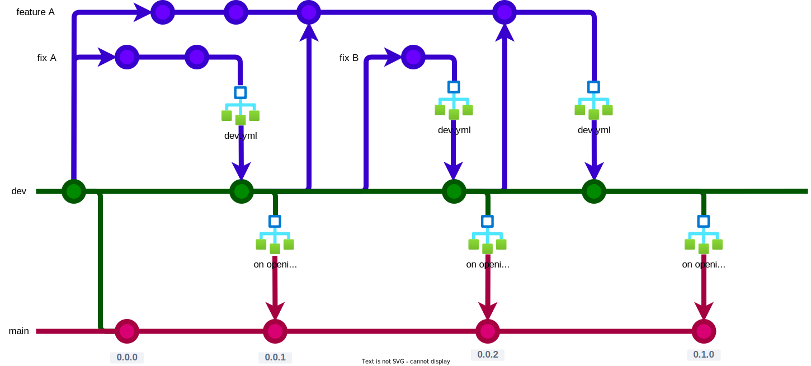

# Development and Deployment Workflow

## 0. Workflow Diagram

.

## 1. Workflow Steps

### 1.1 Create a Branch from dev
- When a new feature or bug fix needs to be developed, start by creating a new branch from the `dev` branch.

### 1.2 Make Changes and Create a Pull Request on dev
- Make the necessary changes on the new branch.
- Create a **Pull Request** to the `dev` branch.
- As long as the tests defined in the `dev.yml` file do not pass, **continue making commits on the branch** to fix the issues.
- Once the tests pass successfully, the branch is merged into `dev`.

### 1.3 Create a Pull Request from dev to main
- From the `dev` branch, create a new Pull Request to the `main` branch.
- The name of this PR **should be** one of the following terms: `patch`, `minor`, or `major`, depending on the nature of the update.
- In the body of the Pull Request, add the changelog in the following format:
    ```
    - changelog 1
    - changelog 2
    - changelog 3
    - ...
    ```

### 1.4 Verification and Merging the Pull Request
- Once the title and changelog are verified, merge the Pull Request.
- At this point, a new release will be automatically created, executing the tasks defined in the `release.yml` file.
