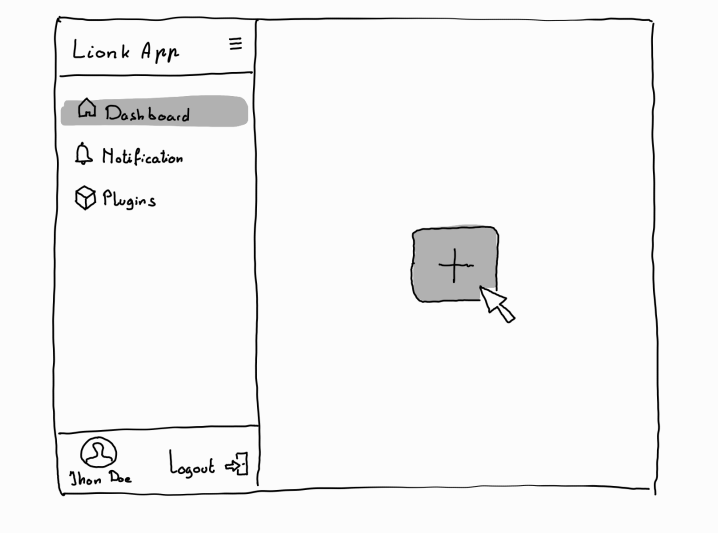
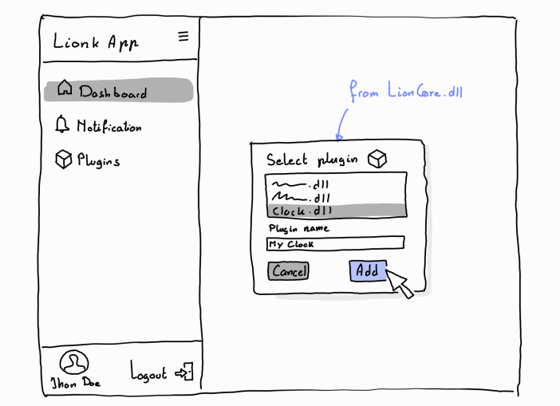
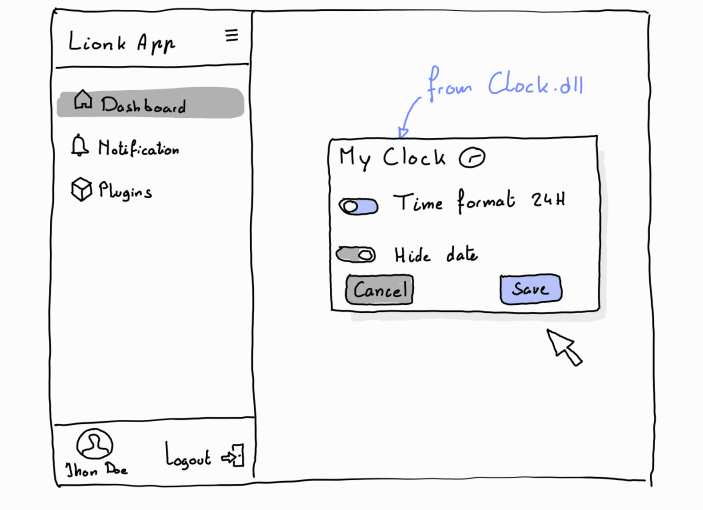
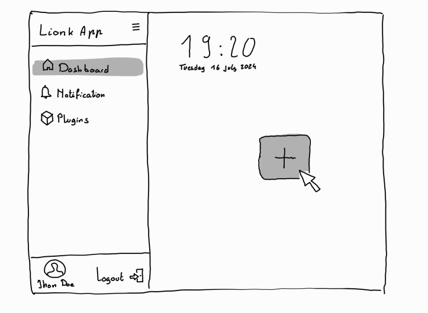
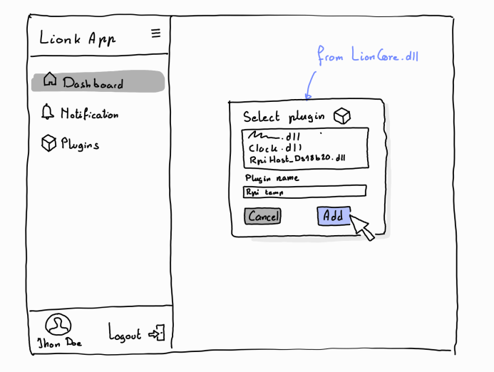
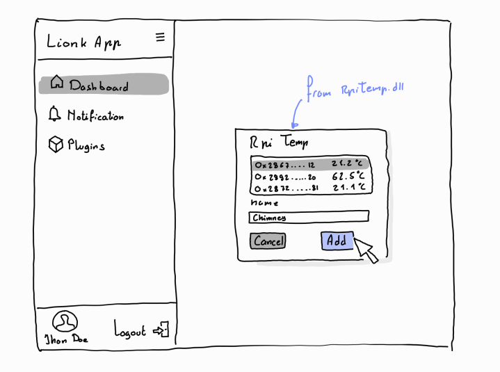
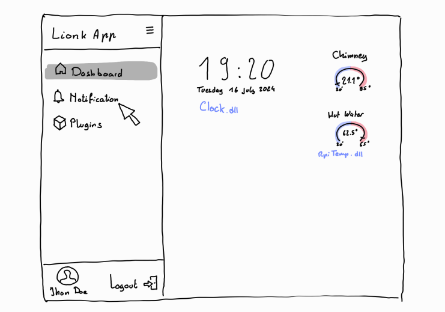
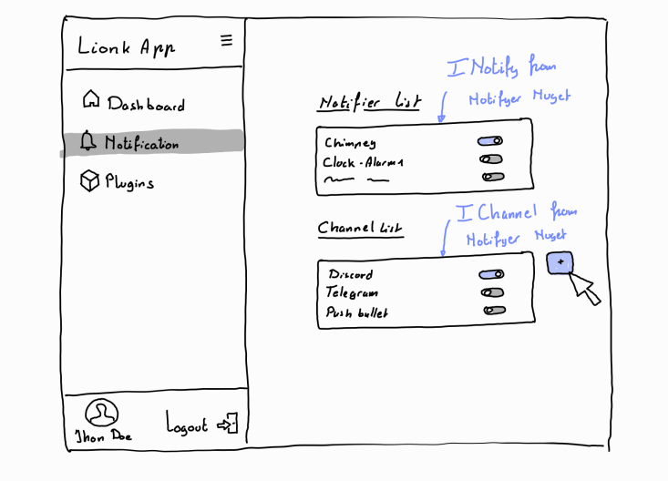
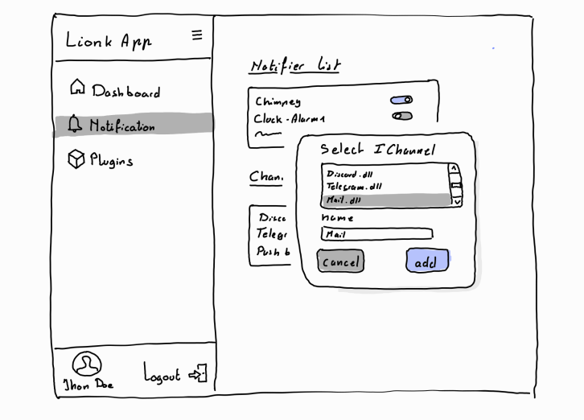

# Lionk Application Mockup

## 0. Introduction

This document describes the mockup of **Lionk application**. The mockup is a visual representation of the application's user interface. It is used to give an idea of what the application will look like and how it will function. The mockup is not a final design, but rather a starting point for further development.

## 1. Dashboard

Just after logging in, the user arrives on the application's homepage. This page features a left sidebar navigation menu that allows the user to navigate between different sections of the application. The homepage also displays a dashboard with information about imported plugins.  

The right part is a window that displays the different pages of the application. We are currently on the `Dashboard` page.

This page shows all the plugins imported by the user. There are currently none. By clicking the `Add Plugin Button` in the center of the window, the user can import a plugin.

## 2. Add Plugin

After clicking the `Add Plugin Button`, a modal window opens. This window allows the user to import a plugin from the plugins listed in the system. The user names the plugin to import and clicks `Add`.

## 3. Plugin Specific Configuration Page

Now that the user has imported a plugin, they can configure the specific settings of the plugin. To do this, they click on the imported plugin. A new page opens, displaying the specific settings of the plugin.
Here is a fictitious example of `Clock.dll`, a plugin that allows displaying a clock on the application.
Its configuration allows setting the time format and choosing whether to hide the date.

## 4. Dashboard with Clock Plugin

Here is our new Dashboard, with the `Clock.dll` plugin imported and configured. The clock is displayed at the top left of the page.

Now let's add another plugin.

## 5. Rpi Plugin

As our application is hosted on a `Raspberry Pi`, we have developed a plugin to access the `GPIO` of the `Raspberry Pi` and read `DS18B20` type temperature sensors, which we named `RPItemp`.

We will now configure the sensors to read.

We have added two sensors, the `28-00000a3b1b12` sensor which we named `Chimney` and the `28-00000a3b1b3d` sensor which we named `Hot water`. We can now see the values of these sensors on our Dashboard.

Let's now configure the notifications.

## 6. Notification Configuration

We have selected `Notification` in the left sidebar navigation menu.

On this page, we see two lists. One listing the plugins that can create notifications, and the other listing the plugins used as `channels` to send notifications.

In our case, we have enabled notifications for the `Chimney` sensor via the `Discord` channel.

But we also want to receive emails. We will add a plugin for this.

By pressing the `+` button next to the channels, a modal window opens with a list of the system's channels. We will select `Mail` and give it a name.

We now have a new `Mail` channel that we will configure.

If the email channel is enabled on the notification page, messages from `Chimney` will also be sent by email.

## 7. Conclusion

This document gives an overview of the application's functionality and shows that the developer can create a plugin and easily add it to the application.
